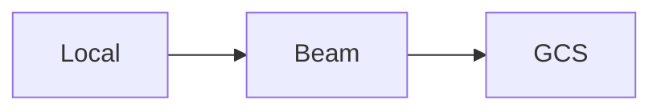

# Arquivos locais enviando para o GCS (Google Cloud Storage)

## Passos para conectar na GCP:

- Criar a conta na GCP
- Criar o projeto
- Habilitar as seguintes APIs, que será utilizada no decorrer do projeto:
    - Dataflow API
    - Compute Engine API
    - Cloud Logging API
    - Cloud Storage
    - Google Cloud Storage JSON API
    - BigQuery API
    - Cloud Pub/Sub API
    - Cloud Datastore API
    - Cloud Resource Manager API

[Link para habilitar as APIs automaticamente](https://console.cloud.google.com/apis/enableflow?apiid=dataflow,compute_component,logging,storage_component,storage_api,bigquery,pubsub,datastore.googleapis.com,cloudresourcemanager.googleapis.com)

- Criar o Bucket
- Criar um service account
- Adicionar uma chave a esse service account
    - Importante notar que o método serve apenas para fins de estudos e a forma ideal para conectar a aplicação à GCP é através de [*Workload Identity Federation*](https://cloud.google.com/iam/docs/workload-identity-federation?_ga=2.50497129.-178770053.1655728093&_gac=1.154225098.1657888901.CjwKCAjwoMSWBhAdEiwAVJ2ndthg03xhnQ_gkBhl0ifhenqn_4gY1xRRWokBFd0uyhjfab_RPCjFjBoCQgsQAvD_BwE)
    

## To Do:

Automatizar a criação da infraestrutura via Terraform, para facilitar a exclusão posterior