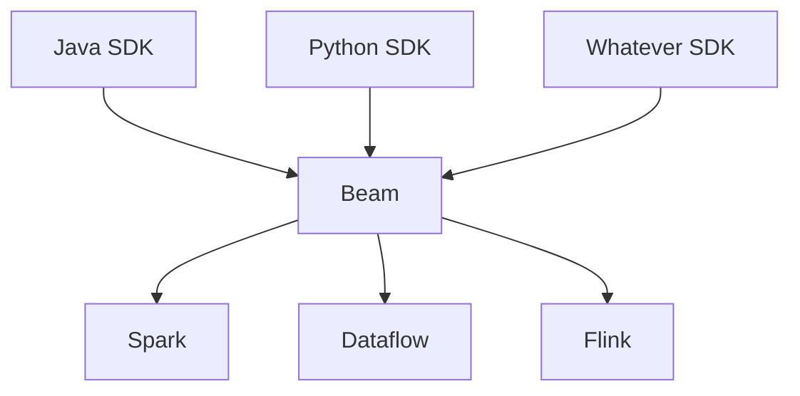
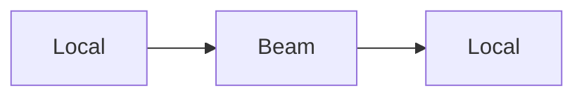
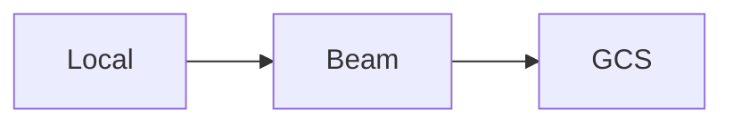
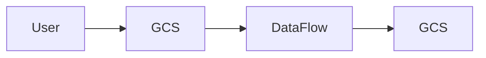

# Google Dataflow e Apache Beam no GCP

## Funcionamento

## Modelos de uso

## Para instalar o Apache Beam localmente

- Upgrade do pip
    - *python -m pip install --upgrade pip*
- instalar o Apache Beam e o Apache Beam com os componente do GCP
    - pip install apache-beam
    - pip install apache-beam[gcp]
    É necessário garantir que esteja instalado o pacote pandas, pois o beam faz uso na importação dos arquivos (aparentemente)    
    - pip install pandas
